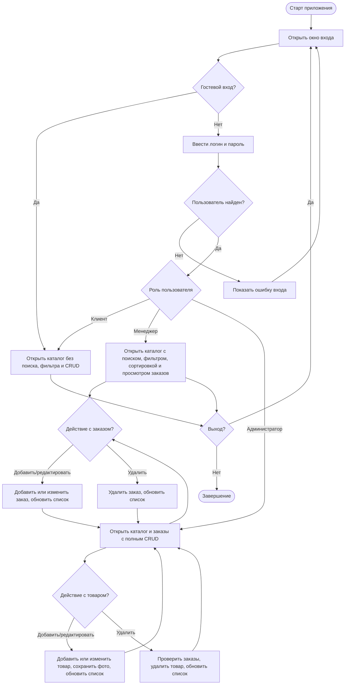

# Блок-схема алгоритма приложения

PDF-версия для сдачи: `docs/algorithm.pdf`.

```mermaid
flowchart TD
    start([Старт приложения])
    auth[Открыть окно входа]
    guest{Гостевой вход?}
    credentials[Ввести логин и пароль]
    check{Пользователь найден?}
    error[Показать ошибку входа]
    role{Роль пользователя}
    client[Открыть каталог без поиска, фильтра и CRUD]
    manager[Открыть каталог с поиском, фильтром, сортировкой и просмотром заказов]
    admin[Открыть каталог и заказы с полным CRUD]
    product_actions{Действие с товаром?}
    product_save[Добавить или изменить товар, сохранить фото, обновить список]
    product_delete[Проверить заказы, удалить товар, обновить список]
    order_actions{Действие с заказом?}
    order_save[Добавить или изменить заказ, обновить список]
    order_delete[Удалить заказ, обновить список]
    logout{Выход?}
    finish([Завершение])

    start --> auth
    auth --> guest
    guest -- Да --> client
    guest -- Нет --> credentials
    credentials --> check
    check -- Нет --> error --> auth
    check -- Да --> role
    role -- Клиент --> client
    role -- Менеджер --> manager
    role -- Администратор --> admin
    client --> logout
    manager --> order_actions
    manager --> logout
    admin --> product_actions
    admin --> order_actions
    product_actions -- Добавить/редактировать --> product_save --> admin
    product_actions -- Удалить --> product_delete --> admin
    order_actions -- Добавить/редактировать --> order_save --> admin
    order_actions -- Удалить --> order_delete --> admin
    logout -- Да --> auth
    logout -- Нет --> finish
```
