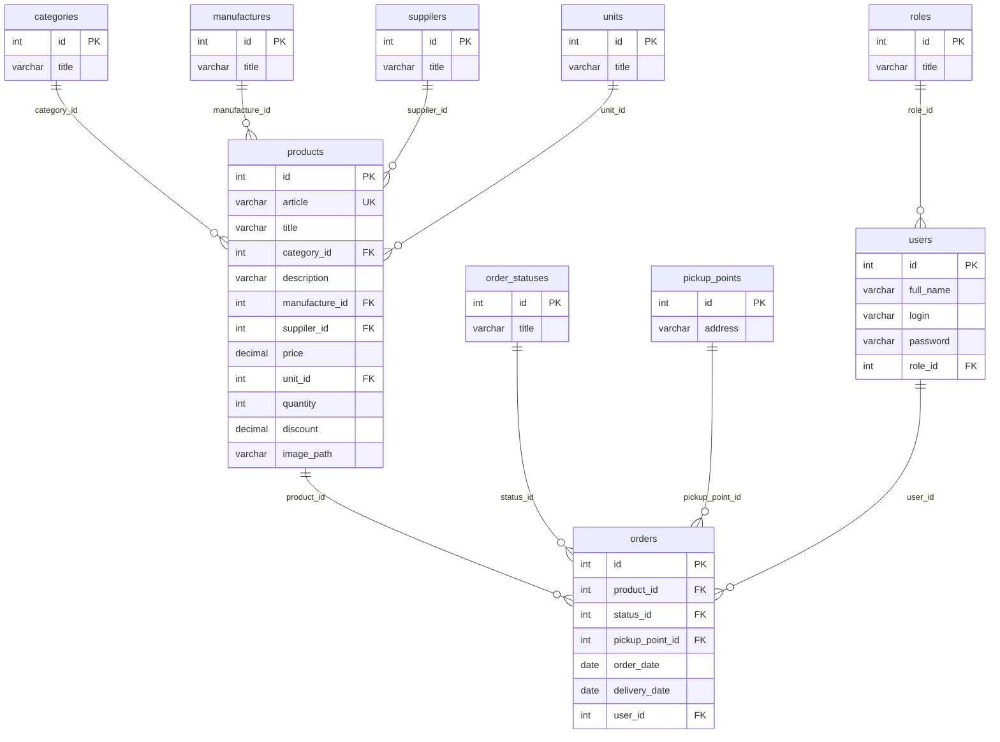

# ER-диаграмма проекта «Обувь»

PDF-версия для сдачи: `docs/er_diagram.pdf`.

```mermaid
erDiagram
    roles ||--o{ users : "role_id"
    categories ||--o{ products : "category_id"
    manufactures ||--o{ products : "manufacture_id"
    suppilers ||--o{ products : "suppiler_id"
    units ||--o{ products : "unit_id"
    products ||--o{ orders : "product_id"
    order_statuses ||--o{ orders : "status_id"
    pickup_points ||--o{ orders : "pickup_point_id"
    users ||--o{ orders : "user_id"

    roles {
        int id PK
        varchar title
    }

    users {
        int id PK
        varchar full_name
        varchar login
        varchar password
        int role_id FK
    }

    categories {
        int id PK
        varchar title
    }

    manufactures {
        int id PK
        varchar title
    }

    suppilers {
        int id PK
        varchar title
    }

    units {
        int id PK
        varchar title
    }

    products {
        int id PK
        varchar article UK
        varchar title
        int category_id FK
        varchar description
        int manufacture_id FK
        int suppiler_id FK
        decimal price
        int unit_id FK
        int quantity
        decimal discount
        varchar image_path
    }

    order_statuses {
        int id PK
        varchar title
    }

    pickup_points {
        int id PK
        varchar address
    }

    orders {
        int id PK
        int product_id FK
        int status_id FK
        int pickup_point_id FK
        date order_date
        date delivery_date
        int user_id FK
    }
```
